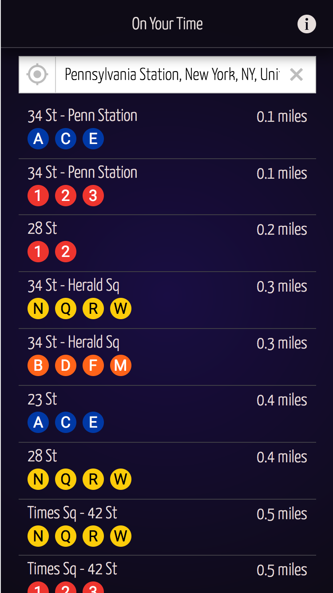
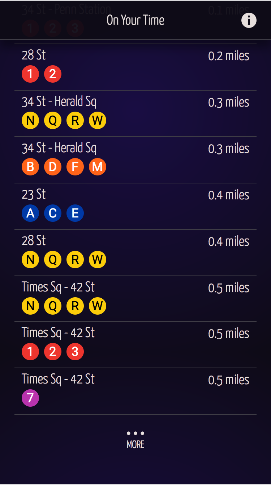
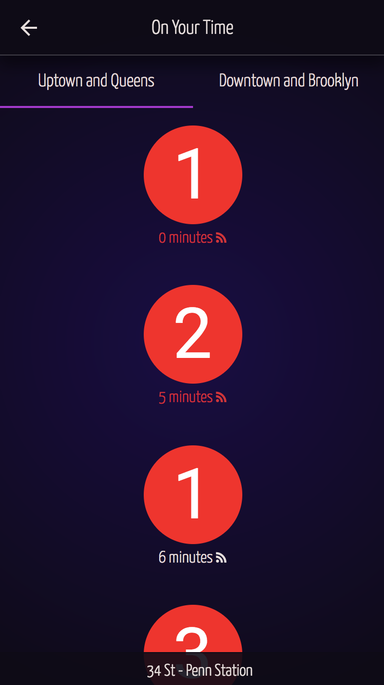
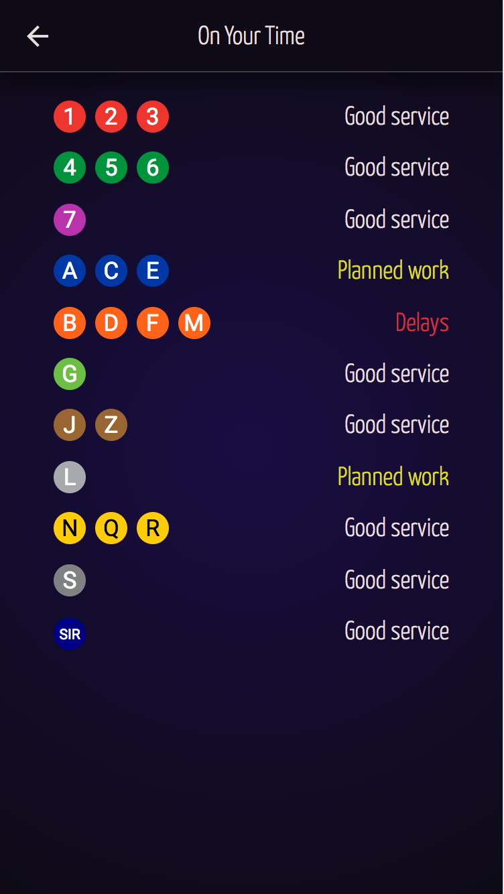

# On Your Time
Take the subway on your own terms.

On Your Time is a subway schedule application that shows the subway stops nearest you, and lists the anticipated departure times of the trains. A live feed from the MTA is used when available to most accurately determine departure times. When live data is not available, the application falls back to using the MTA schedule. In addition, an info screen shows the current status of the various lines, giving relevant information status information such as whether or not the trains are on time, if there are delays, or if there is planned work.

A demo version is available at https://on-your-time.appspot.com. Currently only mobile devices are supported.

